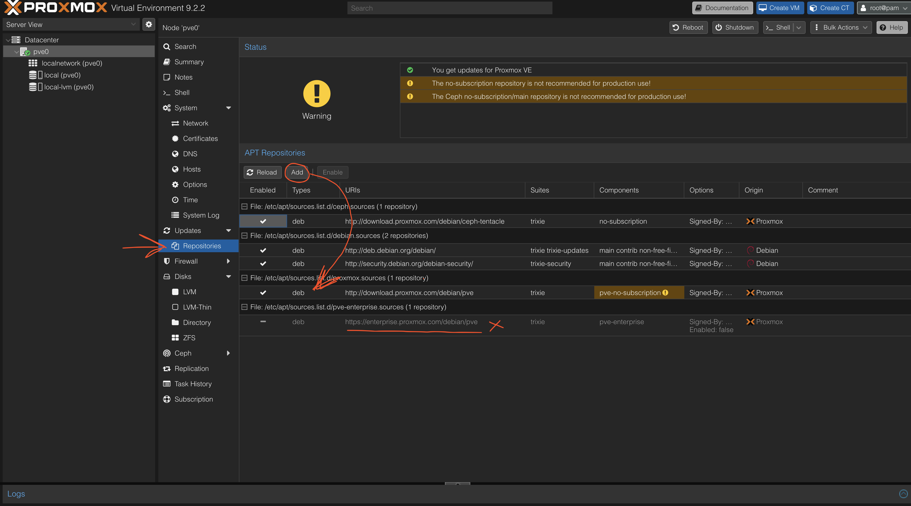
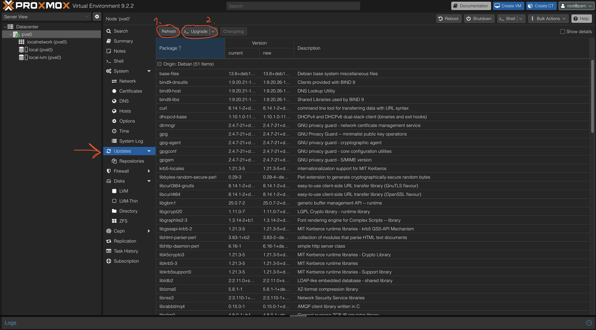

# Proxmox VE — Getting Started

[← Back to Proxmox VE](./README.md)

Step by step from a downloaded ISO to a clean, current Proxmox VE node — as done on `pve0`. Covers the **macOS bootable-USB workflow** (no Rufus needed — Rufus is Windows-only anyway; on macOS the built-in tools do the job), the installer choices and the mandatory post-install routine. The post-install part takes about 15 minutes and happens entirely in the web UI — no SSH needed.

---

## 1. Create the Bootable USB on macOS (no Rufus)

macOS ships everything needed: `diskutil` to manage the stick and `dd` to write the image. The Proxmox ISO is a hybrid image — it can be written raw to a USB stick as-is.

**Identify the USB stick:**

```bash
diskutil list
```

Find the stick by its size and name (e.g. `/dev/disk4`, listed as *external, physical*). **Double-check this — writing to the wrong disk destroys its data.**

**Unmount it (unmount, not eject):**

```bash
diskutil unmountDisk /dev/diskX
```

**Write the ISO:**

```bash
sudo dd if=./proxmox-ve_9.2-1.iso of=/dev/rdiskX bs=4m status=progress
```

Details that matter:

- `rdiskX` (with the `r`) instead of `diskX` — the raw device is several times faster
- `bs=4m` — larger block size, also for speed
- macOS may show a "disk not readable" popup afterwards — that is expected (the stick now carries a Linux filesystem). Click *Ignore*, **not** *Initialize*.

**Flush and eject:**

```bash
sync
diskutil eject /dev/diskX
```

---

## 2. Run the Installer

Boot the target machine from the stick and choose *Install Proxmox VE (Graphical)* — the terminal UI options are only fallbacks for display problems or serial-console setups.

The choices as made on `pve0`:

- **Target disk:** the internal NVMe (`/dev/nvme0n1`), default ext4 + LVM layout
- **FQDN:** `pve0.internal` — the part before the first dot becomes the node name and is effectively permanent; the domain part is easy to change later
- **Management IP:** static, deliberately placed **outside the router's DHCP pool** (high host number) since the ISP router offers no address reservation — no conflict possible by construction
- **No network needed during install:** the installer writes the static config regardless; the machine can be installed offline and cabled later

**After the reboot:** remove the stick when prompted. The web UI is at `https://<management-ip>:8006` (self-signed certificate — the browser warning is expected), login `root` + the password set during installation. The console login prompt on the physical screen can be ignored; all services run without it.

---

## 3. First Login

Open `https://<management-ip>:8006` in a browser:

- The **certificate warning** is expected (self-signed certificate) → *Advanced* → *Proceed*.
- Login: user `root`, the password set during installation, realm **Linux PAM standard authentication**. PAM means "check against the Linux users of the system" — `root` is exactly that. The *Proxmox VE authentication server* realm is a separate, UI-only user database that starts empty.
- The popup **"No valid subscription"** appears on every login. It is not an error — it just notes that the free repository is used. Click *OK*.

> If the realm dropdown is ever **empty**, the page loaded without its API call completing (flaky connection). Hard-reload with `Cmd+Shift+R`.

---

## 4. Switch the Package Repositories

A fresh installation points at the **enterprise repository**, which requires a paid subscription — every update fails until this is changed.

**Node → Updates → Repositories:**

1. Select the row with `https://enterprise.proxmox.com/debian/pve` → **Disable**
2. Click **Add** → choose **No-Subscription** → confirm



The result should look like above: the `pve-no-subscription` repository enabled, the `pve-enterprise` repository disabled (`Enabled: false`). The Debian rows stay untouched; the Ceph no-subscription repository can stay or be disabled — it is unused without Ceph, and its warning is informational only.

---

## 5. Install the First Updates

**Node → Updates:**

1. **Refresh** — reads the package lists (`apt-get update`). The task should end with `TASK OK` and show packages coming from `download.proxmox.com/debian/pve ... pve-no-subscription`.
2. **Upgrade** — opens a live terminal running `apt full-upgrade`. Click into the window, answer `Do you want to continue? [Y/n]` with `y` + Enter and let it run.
3. When the prompt returns (`root@pve0:~#`), the upgrade is done — type `exit` (or close the window).



4. **Reboot** (top right) — the first update almost always ships a new kernel, which needs one boot to become active. The node is back in ~2 minutes.

---

## 6. Done — What Comes Next

The base system is now clean and current. Follow-ups, each documented as it gets built:

- Storage layout (ZFS pool for guest data)
- VLAN-aware bridge on the trunk port
- First guests: see the [target layout](../../README.md#what-will-run-here)
- Dedicated users: a personal admin user with 2FA, and a `terraform@pve` API token once IaC touches this machine — day-to-day work should not run as `root`
