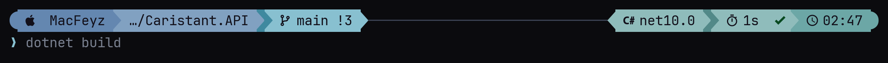

# 💻 Dev PC — The Machine Everything Is Operated From

[← Back to Setup Overview](../README.md)


Every other machine in this homelab is documented down to the fuse. The machine those decisions are actually made on was not — which is a gap, because a workstation is just as much a reproducible setup as a node is. A new laptop, a wiped disk or a second machine should not mean rebuilding a working environment from memory.

This section is the answer to *"what has to be installed and configured before I can work on this homelab?"* — as documentation, and as a script that does it.



---

## Operating System Support

| OS | Status | What exists |
|---|---|---|
| [🍎 macOS](./macos) | ✅ Active | Full setup: Homebrew, Warp, shell, prompt — one script |
| [🐧 Linux](./linux) | 🔜 Planned | Will differ — different package manager, different terminal |
| [🪟 Windows](./windows) | 🔜 Planned | Will differ — WSL2 is the likely path |

macOS is the machine this homelab is built on, so it is the one that is properly supported. The other two get a folder and an honest note rather than an untested script.

The **[servers](./servers)** folder is the odd one out: it is not a dev PC, but it carries the same shell environment onto the nodes and `pve0` — because the prompt runs on whatever machine the shell lives in, not on the one looking at it.

---

## 🍺 Homebrew — The Package Manager

Everything on the Mac is installed through [Homebrew](https://brew.sh). Not because manual downloads do not work, but because a `.dmg` dragged into `/Applications` leaves no trace anyone can read later. A package manager turns "what is installed on this machine" into a question with an answer.

```bash
/bin/bash -c "$(curl -fsSL https://raw.githubusercontent.com/Homebrew/install/HEAD/install.sh)"
```

This is the one step that needs your password — it creates `/opt/homebrew`. On Apple Silicon that path is not in the default `PATH`, so the installer prints a line to add to `~/.zprofile`:

```bash
eval "$(/opt/homebrew/bin/brew shellenv)"
```

Two kinds of packages, and the distinction matters when reading the scripts:

| | Command | What it is |
|---|---|---|
| **Formula** | `brew install jq` | Command line software, compiled or as a prebuilt bottle |
| **Cask** | `brew install --cask warp` | A macOS `.app` or a font — installed into `/Applications` or `~/Library/Fonts` |

Day to day:

```bash
brew search <name>          # find a package
brew info <name>            # what it is, what it depends on
brew list --formula         # what is installed
brew outdated               # what could be updated
brew upgrade                # update everything
brew uninstall <name>       # remove it
brew autoremove && brew cleanup   # drop orphaned dependencies and old versions
```

---

## The Toolchain

What the setup script installs, and why each one earns its place:

| Package | Type | Why |
|---|---|---|
| `starship` | Formula | The prompt. Cross-shell, cross-platform, a single static binary — which is what makes it work on the servers too |
| `zsh-autosuggestions` | Formula | Greys in the rest of a command from history as you type |
| `zsh-syntax-highlighting` | Formula | Colours a command green or red *before* you press enter |
| `jq` | Formula | JSON formatting and filtering — constant companion when working with `kubectl` and APIs |
| `font-jetbrains-mono-nerd-font` | Cask | Supplies the icon glyphs. Without it every icon in the prompt is an empty box |
| `warp` | Cask | The terminal |

Deliberately **not** installed: a shell framework. See below.

---

## Warp As The Terminal

[Warp](https://www.warpdev.com) replaced iTerm2 here. What it does differently is that it treats a command and its output as one **block** — you can scroll, fold, copy or share a single command's output instead of hunting through a wall of scrollback. On a machine where a lot of `kubectl` output goes by, that alone is worth the switch.

It also brings its own autocomplete and history search, which is the reason the shell configuration below stays as small as it does — most of what a framework like Oh My Zsh adds, the terminal already does.

One setting matters for how this looks:

**Settings → Appearance → Text → Font → `JetBrainsMono Nerd Font`**

Note the missing **Mono**. The Mono variant of a Nerd Font forces every glyph into a single character cell so column alignment stays exact — icons get squeezed for it. The regular variant lets them use their natural width, and they become noticeably larger. The setup script switches this automatically when Warp is closed.

---

## Shell: zsh Without A Framework

The shell is plain zsh with four things loaded on top: completion, autosuggestions, syntax highlighting and Starship. No Oh My Zsh.

Oh My Zsh was here before and got removed. It is a good project, but it loads a large amount of code to provide aliases and completions that are either already in zsh or already in Warp. What was left after removing it was a 60-line `~/.zshrc` that does the same job and starts faster.

The full reasoning, and how the prompt itself is built, is in **[terminal-designs.md](./terminal-designs.md)**.

---

## Getting It Running

One command on a fresh machine:

```bash
curl -fsSL https://raw.githubusercontent.com/feyzekrn/Homelab/main/setup/devpc/macos/bootstrap.sh | bash
```

Every step, and what to do when something does not fit, is in **[commands.md](./commands.md)**.

| | |
|---|---|
| **[commands.md](./commands.md)** | Step-by-step command list — fresh machine, existing machine, servers, rollback |
| **[terminal-designs.md](./terminal-designs.md)** | Why the terminal looks the way it does, and how the prompt is built |
| **[macos](./macos)** | The macOS setup script and its details |
| **[servers](./servers)** | The same prompt on the nodes and `pve0` |
| **[starship](./starship)** | The prompt config, its generator and the `.zshrc` |

---

## A Note On The Scripts

They are **idempotent** — running them twice is not a mistake, the second run skips what is already there. They **back up** every file before replacing it, into `~/.dotfiles-backup/<timestamp>/`. And they all take **`--dry-run`**, which prints what would happen and changes nothing.

That is not politeness. A setup script that cannot be run again is a script nobody dares to run at all.
