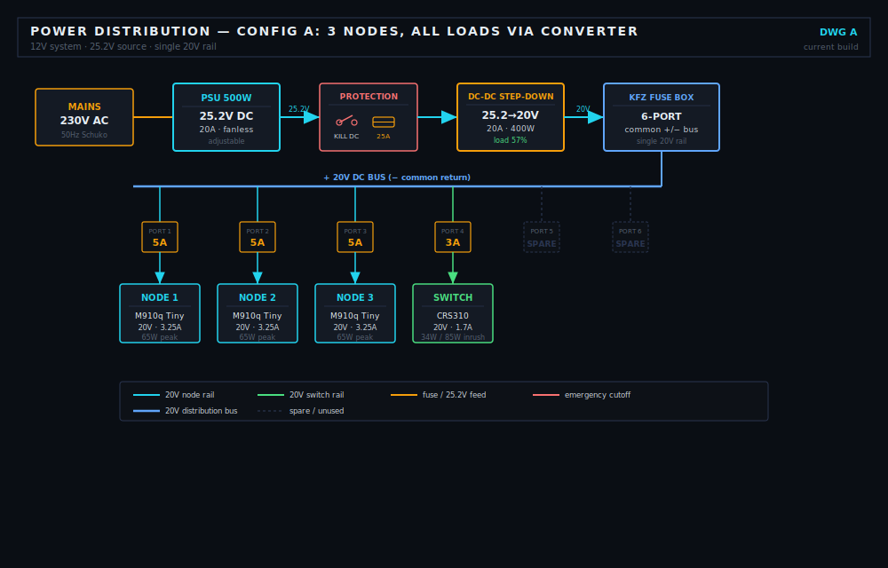
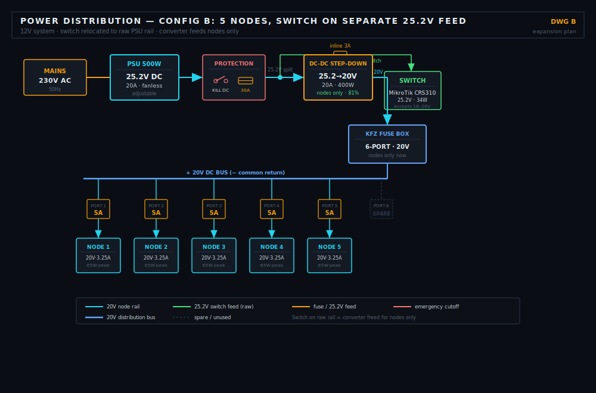

# 🔋 Power Supply — PSU, DC/DC Converter & Fuse Box

[← Back to Setup Overview](./README.md)

This page documents the complete 12V/20V power chain for the cluster: how mains AC becomes the regulated 20V the Lenovo nodes need, why each component was chosen, and the math that proves the parts actually fit together. Power electronics is one of the few areas in this build where a wrong assumption damages hardware instantly — so every value here is calculated, not estimated.

---

## Circuit Diagrams

**Config A — Current build (3 nodes, all loads via converter):**



**Config B — Expansion plan (5 nodes, switch relocated to raw 25.2V feed):**



```
A:  230V AC → PSU 25.2V → Kill + Fuse → DC-DC 20V → KFZ Box → 3 Nodes + Switch
B:  230V AC → PSU 25.2V → Kill + Fuse → split:
                                          ├─ inline 3A → Switch (25.2V raw)
                                          └─ DC-DC 20V → KFZ Box → 5 Nodes
```

---

## The Power Chain at a Glance

| Stage | Component | In | Out |
|---|---|---|---|
| 1 | PSU / Rectifier | 230V AC | 25.2V DC, max 20A |
| 2 | Kill Switch + Main Fuse | 25.2V | 25.2V (protected) |
| 3 | DC-DC Step-Down Converter | 25.2V | 20V DC, max 20A |
| 4 | KFZ Fuse Box (6-port) | 20V | 20V to each load |
| 5 | Loads | 20V | 3× Node + MikroTik |

---

## Parts List

| Part                      | Spec |           Price | Where to find it |
|---------------------------|---|----------------:|---|
| PSU 500W MEAN WELL MW UHP-500-24                 | 230V AC → 25.2V DC, ~20A, fanless |         74,79 € | [voelkner.de](https://www.voelkner.de/index.php?mp=products&file=info&ref=43&products_id=1407560) |
| DC-DC Step-Down Converter | 25.2V → 20V, 20A / 500W |           ~25 € | [eBay listing](https://www.ebay.de/itm/306701463710) |
| KFZ Fuse Box              | 6-port blade fuse, common +/- bus |           ~ 8 € | [eBay listing](https://www.ebay.de/itm/317781950022) |
| Emergency Kill Switch     | Rocker/push, ≥25A **DC-rated** |         ~ 4–8 € | [Amazon](https://www.amazon.de/s?k=12V+DC+Notaus+Schalter+30A) |
| Main Fuse 25A             | ANL / blade, main rail protection |         ~ 2–5 € | [Amazon](https://www.amazon.de/s?k=ANL+Sicherung+25A) |
| Blade fuses 3A / 5A       | Per-branch protection in fuse box |       ~ 5 € set | [Amazon](https://www.amazon.de/s?k=KFZ+Sicherungen+Sortiment) |
| Cable 4 mm² red/black     | Main feed (PSU → converter → box) |       ~ 2–3 €/m | [Amazon](https://www.amazon.de/s?k=kabel+4mm2+rot+schwarz) |
| Cable 1.5 mm² red/black   | Per-node runs to slim-tip connector | ~ 0.80–1.50 €/m | [Amazon](https://www.amazon.de/s?k=kabel+1.5mm2+rot+schwarz) |

> Prices for the PSU, converter and fuse box are TBD — confirm on the linked product pages.

---

## Why the MEAN WELL MW UHP-500-24?

The PSU is the heart of the system, and this specific unit was chosen for reasons that go beyond just "it outputs enough watts":

**Fanless and silent.** For a homelab running 24/7 in a living space, an audible fan is a dealbreaker. This unit is passively cooled, so it adds zero noise to the rack. A standard ATX PC power supply — the cheap obvious alternative — has a temperature-controlled fan that would run constantly under continuous load.

**Compact, industrial build.** It is a sealed industrial brick, not a consumer device with unnecessary connectors and form factor overhead. It mounts cleanly and takes minimal space in the rack.

**25.2V output, adjustable down toward 20A.** The 25.2V output sits comfortably above the 20V the nodes need, which is exactly what a step-down converter wants as input — you always step *down* to a stable regulated voltage. The output can be trimmed via a potentiometer.

**The adjustment trade-off you must understand.** The PSU's adjustment screw does **not** independently set current. Power is fixed by the relationship `P = U × I`. If you turn the voltage down, the available power at a given current also changes. You cannot "dial in 20A" as an independent target — the screw moves voltage, and watts follow. This is why the current limiting is handled by the **converter**, not the PSU. The PSU just provides a clean, slightly-oversupplied 25.2V source; the converter does the precise regulation. Trying to use the PSU alone to hit exactly 20V/20A would mean fighting the `P = U × I` relationship and risking either undervoltage (node won't boot) or an unstable rail.

---

## Why the DC-DC Step-Down Converter?

This is the component that makes the whole chain safe. Here is the problem it solves:

The Lenovo M910q Tiny requires **exactly 20V**. Above that risks damaging the board; below it the node won't boot reliably. The PSU outputs **25.2V** — correct as a source, but 5.2V too high to feed the nodes directly. The PSU also cannot cleanly regulate down to a stable 20V on its own (see the `P = U × I` trade-off above).

The DC-DC step-down converter bridges this gap. It takes the 25.2V input and outputs a **stable, regulated 20V** regardless of small fluctuations on the input side. It also enforces a hard **20A current limit**, which protects every downstream component in a fault condition.

### Voltage / Current / Power across the converter

A step-down converter conserves *power*, not current. As voltage drops, current rises for the same wattage:

```
Ideal (η ≈ 100%):   P_in = P_out
                    U_in × I_in = U_out × I_out
                    25.2V × I_in = 20V × I_out
                    → I_out = I_in × (25.2 / 20) = I_in × 1.26

In practice (η ≈ 94%):
                    P_out = P_in × 0.94
                    A small amount of input power is lost as heat in the converter.
```

This is the key insight that catches people out: a "20A converter" on the **20V output side** can deliver up to `20V × 20A = 400W`, and to supply that it pulls roughly `400W / 25.2V / 0.94 ≈ 16.9A` from the PSU. The numbers are not 1:1 across the converter, and assuming they are leads to undersizing.

---

## Why 500W? — The Math

This is where the original planning had an error worth documenting. The nodes do **not** need their peak power multiplied twice. Let's do it correctly.

### Per-node power — the real numbers

The Lenovo M910q Tiny with an i5-6500T:

| State | Voltage | Current | Power |
|---|---:|---:|---:|
| Idle | 20V | ~0.5 A | ~10 W |
| Typical load | 20V | ~1.75 A | ~35 W |
| **Cold-start peak** | 20V | **~3.25 A** | **~65 W** |

The **65W cold-start peak** is the number that sizes the system. When a node powers on, the i5-6500T plus capacitor inrush briefly pulls up to the full 3.25A the OEM 65W adapter is rated for — well above its ~35W steady-state. This is a real, measured spec (the Lenovo OEM brick is 20V / 3.25A / 65W), not a multiplied estimate.

### Total system load (current 3-node config)

| Load | Steady peak | Current @ 20V | Cold-start inrush | Branch fuse |
|---|---:|---:|---:|---:|
| Node 1 | 65 W | 3.25 A | ~65 W (already peak) | 5 A |
| Node 2 | 65 W | 3.25 A | ~65 W (already peak) | 5 A |
| Node 3 | 65 W | 3.25 A | ~65 W (already peak) | 5 A |
| MikroTik CRS310 | 34 W | 1.70 A | ~85 W (2.5× for ms) | 3 A |
| **Total steady peak** | **229 W** | **11.45 A** | — | — |

### Cold-start inrush — both nodes AND switch

This is the correction worth highlighting. The node figure of 65W *is already the cold-start peak* — the i5-6500T's inrush is what defines that 3.25A rating, so it isn't multiplied again. But the **switch** has its own separate inrush that the earlier math ignored.

A switching power supply like the MikroTik's draws a brief inrush as its input capacitors charge — typically **2–3× rated power for a few milliseconds**:

```
MikroTik steady:  34W
MikroTik inrush:  34W × 2.5 ≈ 85W  (duration: a few ms)
```

Worst-case simultaneous cold start (everything energizes at the exact same instant after a power cut):

```
3 nodes inrush:   3 × 65W = 195W
Switch inrush:           ≈  85W
─────────────────────────────────
Absolute worst case:     280W

280W / 20V = 14A  →  70% of the 20A converter
280W / 0.94 / 25.2V ≈ 11.8A  →  59% of the PSU
```

Even assuming everything spikes at once — which rarely happens because inrush events are milliseconds long and don't perfectly align — the system stays under 70% of the converter and under 60% of the PSU. **This is exactly the headroom the 500W PSU and 20A converter were chosen to provide.** A supply sized to the 229W steady figure would have far less margin against this 280W instantaneous spike.

### Why a 500W PSU for a 229W steady load?

```
Converter output side:  229W / 20V  = 11.45A  →  57% of the 20A converter
PSU side (with losses):  229W / 0.94 / 25.2V ≈ 9.7A  →  ~48% of the PSU's 20A
```

The 500W PSU runs at roughly **half capacity** under full cold-start load. That headroom is the entire point:

- **Simultaneous cold start.** If all three nodes boot at once after a power cut, they hit 65W each at the same instant — 195W of nodes plus the switch. The headroom absorbs this spike without the rail sagging.
- **Efficiency.** A PSU runs most efficiently between 50–80% load. At ~48% we sit right at the edge of the optimal band.
- **Expansion.** Room for a 4th and 5th node without immediately replacing the PSU.

A PSU sized exactly to 229W would have no margin for the simultaneous inrush, and the 12V/20V rail could collapse during boot — a failure that looks exactly like a dead motherboard but is actually just an undersized supply.

---

## Component Compatibility Check

Confirming the parts actually work together:

| Check | Requirement | Actual | Result |
|---|---|---|---|
| PSU output ≥ converter input | Converter needs >20V in | 25.2V | ✅ |
| Converter output = node spec | Nodes need exactly 20V | 20V regulated | ✅ |
| Converter current ≥ load | Load is 11.45A | 20A limit | ✅ 57% |
| MikroTik voltage range | Accepts 18–28V | Fed 20V | ✅ |
| PSU power ≥ total load | Load 229W | 500W | ✅ 46% |
| Fuse box voltage | Single rail OK | 20V common bus | ✅ |

All stages are matched. The only deliberate constraint: the KFZ fuse box has a **common +/- bus**, so every port carries the same voltage. That's why the current design routes everything — nodes *and* switch — through the converter onto one 20V rail.

---

## Emergency Kill Switch

A kill switch rated for at least 25A **DC** is wired in series right after the PSU output, before the main fuse and converter. One press cuts all power to the entire cluster.

**Why it matters:**
- Instantly de-energizes the whole system for maintenance or emergencies — no unplugging individual nodes
- Sits upstream of everything, so it kills nodes, switch and converter together
- Additional safety layer on top of the PSU's own mains switch

> ⚠️ **Must be DC-rated.** An AC-only switch will arc destructively when breaking a DC load at this current. DC arcs do not self-extinguish at a zero-crossing the way AC does. Look for switches explicitly rated for 12–24V DC at ≥25A.

---

## Cable Sizing

Every run is sized for its actual current plus margin. Undersized cable means voltage drop, heat, and in the worst case fire.

### Main rail (PSU → Kill Switch → Converter → Fuse Box)

```
Max current at 25.2V side: 500W / 25.2V = 19.8A
→ Cable: 4 mm² copper (rated ~32A continuous) — comfortable margin
→ Keep short (< 50cm) to minimize voltage drop
```

### Per-node runs (Fuse Box → slim-tip connector)

```
Peak current: 65W / 20V = 3.25A
→ Cable: 1.5 mm² copper (rated ~16A) — large margin
→ Branch fuse: 5A blade
```

### MikroTik run (Fuse Box → CRS310)

```
Current: 34W / 20V = 1.70A
→ Cable: 1.5 mm² copper
→ Branch fuse: 3A blade
```

---

## The Lenovo Slim-Tip (Square) Connector

The M910q Tiny does not use a barrel jack. It uses Lenovo's **slim-tip / square connector** — a rectangular plug (outside ~11×4mm, with a centre pin) carrying 20V DC. These are not generic, so each node cable needs either a salvaged OEM slim-tip pigtail or a compatible aftermarket slim-tip-to-bare-wire lead.

> ⚠️ **Polarity is critical.** Reversing +/- on 20V DC destroys the board instantly with no warning. Verify polarity with a multimeter before connecting any node for the first time.

Build notes:
- Strip ~8mm on the bare end, use ferrules into the fuse box screw terminals
- Label each cable with its node number before routing
- Double-check 20V (not 25.2V) at the slim-tip with a multimeter before plugging in a node

---

## Upgrade Path

**Short term**
- Measure real per-node draw with a clamp meter under Kubernetes load — replace the 65W spec-peak with measured values
- Print the wiring diagram and tape it inside the enclosure

**Mid term — 4th node**
```
4 × 65W = 260W + 34W switch = 294W
294W / 20V = 14.7A → 74% of converter ✅ still fine, no changes needed
```

**At 5 nodes — relocate the switch**
```
All-on-converter: 5 × 65W + 34W = 359W / 20V = 17.95A → 90% ⚠️ too tight

Solution: move the MikroTik to its own 25.2V branch straight off the PSU
with an inline 3A fuse (the switch accepts 18–28V, so no converter needed).

Converter then feeds nodes only: 5 × 65W = 325W / 20V = 16.25A → 81% ✅
```
This is why the current single-rail design is fine to start with — the switch relocation is a known, documented step for when it's actually needed, not something to build now.

**Long term — 6–7 nodes**
- A second DC-DC converter in parallel, or a higher-current converter
- Possibly a larger PSU (750–1000W) if total cold-start exceeds comfortable PSU margin
- Consider a DIN-rail fuse block instead of the KFZ box for cleaner expansion

---

## Alternatives Considered

| Alternative | Advantage | Why not chosen |
|---|---|---|
| Individual 65W OEM bricks per node | Plug-and-play, no wiring | Cable chaos, no central kill switch, no shared efficiency |
| ATX PC power supply | Cheap, available everywhere | Audible fan, not designed for continuous single-rail DC load |
| 24V PSU + step-down | Slightly closer to 20V target | 25.2V unit was available fanless; 24V offers less trim headroom |
| Sizing PSU exactly to load | Cheaper, smaller | No margin for simultaneous cold-start inrush — rail collapse risk |
