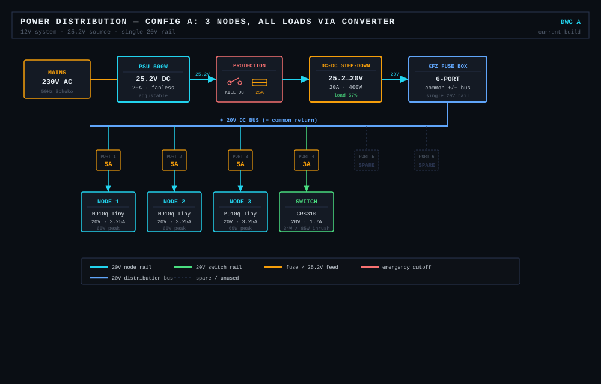
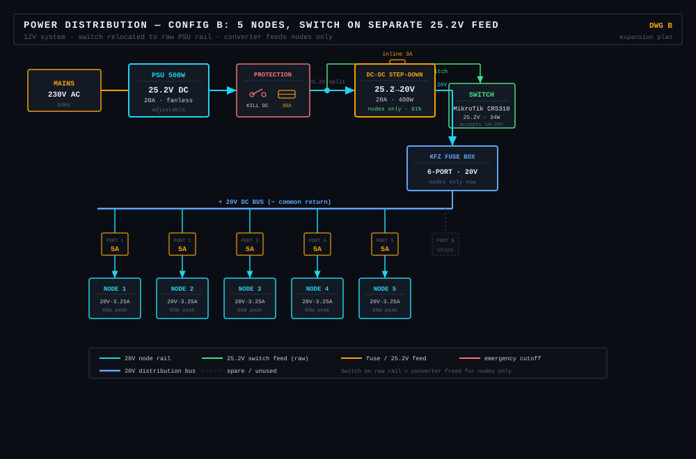

# 🔋 Power Supply — PSU, DC/DC Converter & Fuse Box

[← Back to Setup Overview](../README.md)

This page documents the complete power chain for the lab: how mains AC becomes the regulated voltages each machine needs, why each component was chosen, and the math that proves the parts actually fit together. Power electronics is one of the few areas in this build where a wrong assumption damages hardware instantly — so every value here is calculated, not estimated.

> ✅ **Update — the PSU is now a [UHP-750-24](https://www.reichelt.com/de/en/shop/product/switching_power_supply_closed_750_w_24_v_31_3_a-306672) (751W), bought for 50 €.** This page previously planned a 500W unit and concluded that the PSU was the component running out first once `pve0` joined the rail. That conclusion is obsolete: at 751W the supply has headroom everywhere the lab realistically goes, and **the node converter is once again the first limit** (98% at six nodes, while the PSU sits at 55%). All tables below have been recalculated. See [Is 750W Enough?](#is-750w-enough).
>
> The unit also cost **less** than the 500W one it replaces (~75 €), which makes this the rare upgrade with no trade-off to document.

> 🛒 **Also bought since:** 3× Lenovo slim-tip pigtail (3-pin, ~3 € each) and a **second KFZ fuse box**, so each regulated rail gets its own distributor instead of the 19V branch hanging off a loose inline holder. The 230V side gets a panel-mount IEC inlet with an integrated fuse holder. **Still missing: the two converters** — see [What to actually buy](#what-to-actually-buy).

> ⚡ **The lab is running on an interim power path right now.** The two converters are still unbought, so the nodes are powered by **2× 240W USB-C PD chargers** with USB-C → slim-tip cables, and the MS-01 stays on its own OEM brick. **This page still describes the DC rail as the target** — every table below is the plan, not the present. What is actually plugged in is documented in [The interim power path](#the-interim-power-path-usb-c-pd).

---

## Circuit Diagrams

**Config C — Current build (3 nodes + switch + MS-01, two regulated rails):**

```
C:  230V AC → IEC inlet (AC fuse) → PSU 25.2V → Kill + Main Fuse → split:
                                          ├─ inline  3A → MikroTik  (25.2V raw)
                                          ├─ DC-DC 20V → KFZ Box A → Lenovo nodes
                                          └─ DC-DC 19V → KFZ Box B → MS-01 (pve0)
```

> ⚠️ **The fuse in the IEC inlet does not replace the DC main fuse.** It protects the *mains* side against a fault inside the PSU — roughly 2A at 230V. The 25A ANL fuse protects the *DC* rail, where the PSU can source 29.8A into a short. They guard different faults and both are needed.

**Superseded configs** — these described the lab before `pve0` joined the rail. Kept because the reasoning behind the switch relocation still applies:

```
A:  230V AC → PSU 25.2V → Kill + Fuse → DC-DC 20V → KFZ Box → 3 Nodes + Switch
B:  230V AC → PSU 25.2V → Kill + Fuse → split:
                                          ├─ inline 3A → Switch (25.2V raw)
                                          └─ DC-DC 20V → KFZ Box → 5 Nodes
```





> ⬜ **The two SVGs above still show configs A and B and no longer match the build.** They need to be redrawn for Config C — second converter, MS-01 branch, relocated switch, and now a second fuse box on the 19V rail.

---

## The Power Chain at a Glance

| Stage | Component | In | Out |
|---|---|---|---|
| 1 | PSU / Rectifier | 230V AC | 25.2V DC, max ~29.8A |
| 2 | Kill Switch + Main Fuse | 25.2V | 25.2V (protected) |
| 3a | Inline fuse 3A | 25.2V | 25.2V → MikroTik |
| 3b | Buck Converter #1 (40A) | 25.2V | 20V DC, ~20A usable |
| 3c | Buck Converter #2 | 25.2V | 19V DC |
| 4a | KFZ Fuse Box A (6-port) | 20V | 20V + 5A blade to each node |
| 4b | KFZ Fuse Box B (6-port) | 19V | 19V + 15A blade to the MS-01 |
| 5 | Loads | — | 3× Node · MikroTik · MS-01 |

**Why two fuse boxes.** A KFZ box has a **common +/- bus**, so one box can only ever carry one voltage. The 20V nodes and the 19V MS-01 therefore cannot share one — this is the same constraint that already forced the MikroTik onto its own inline fuse. Box B holds a single load today, which looks wasteful for ~8 €, but it buys a proper screw-terminal landing point for the 2.5 mm² MS-01 run instead of a floppy inline holder, and it is where a second 19V load would go.

---

## The Interim Power Path (USB-C PD)

**This is what is actually powering the lab today.** It exists because the two buck converters are the [last unbought part](#what-to-actually-buy) of the DC chain, and waiting for them would mean waiting to run the cluster at all.

```text
  230V ── Good Connections 10" PDU (switched) ──┬── USB-C PD 240W  #1 ──┬── node0   (USB-C → slim-tip)
                                                │                      └── node1   (USB-C → slim-tip)
                                                │
                                                ├── USB-C PD 240W  #2 ──┬── node2   (USB-C → slim-tip)
                                                │                      └── DeskPi 9" monitor (USB-C)
                                                │
                                                ├── MS-01 OEM brick ─────── pve0  (19V, standalone)
                                                └── CRS310 OEM brick ────── switch
```

| Item | Qty | Unit | Total |
|---|--:|--:|--:|
| USB-C PD charger, 240W | 2 | ~40 € | **~80 €** |
| USB-C → Lenovo slim-tip cable | 3 | 3 € | **9 €** |
| | | **Interim total** | **~89 €** |

### Why this works electrically

A 240W USB-C supply is **USB PD 3.1 EPR**, and it reaches 240W as 48V × 5A. The Tiny nodes cannot use that: the slim-tip cable negotiates the **20V** fixed profile, and 20V is capped at 5A by the standard. So each node cable is a **100W** channel regardless of what the charger is rated for — comfortably above the M910q's [65W / 3.25A cold-start peak](#per-node-power--the-real-numbers), and the 240W figure is mostly headroom that this application never touches.

**The 240W rating still buys something, just not per-node headroom:** it is what lets one charger carry two 20V/3.25A negotiations at the same time without either port dropping to a lower profile.

> ⚠️ **Verify simultaneous per-port output, not the total.** Multi-port GaN chargers advertise a *combined* figure and re-allocate when several ports are active — a "240W" unit can drop to 140W + 100W, or worse, shift one port down to the 15V or 9V profile. A Tiny that gets 15V instead of 20V does not run at reduced power; it does not boot. Check the per-port table on the charger itself, with both node cables plugged in.

### What this path gets right by accident

**The ID resistor problem disappears.** The [whole soldering exercise](#the-third-pin-is-not-a-second-ground) — measuring bare pigtails, adding 270 Ω between the centre pin and ground, proving it on one node before building the others — exists because a bare slim-tip pigtail has no ID line. A commercial USB-C → slim-tip cable has that resistance built into the plug; it is what makes the machine accept the adapter at all. For the interim, that entire ⬜ item is moot.

**The central kill switch survives.** The [switched 10" PDU](#the-emergency-switch-belongs-on-the-230v-side) is upstream of all four supplies, so one flip still kills everything in the rack. This was the main objection to per-device bricks in the [alternatives table](#alternatives-considered), and the PDU answers it independently of which DC topology sits behind it.

**Efficiency is a wash, or slightly better.** A GaN PD charger runs ~92–94% at load. The planned chain is PSU (~91%) × buck converter (~94%) ≈ **86%**. The interim is not the compromise it looks like on this axis — it is a few points ahead.

> 💡 **Leave the MEAN WELL out of the interim entirely.** With only the CRS310 on it, a 751W supply would run at ~4.5% load, which is the worst point on its efficiency curve. The switch has its own OEM adapter; use it, and keep the PSU in the box until the converters arrive.

### What it does not solve

- **Four supplies instead of one**, each with its own wall wart and its own cable run — the "cable chaos" objection is real and unaddressed.
- **No per-branch fusing under one roof.** Each charger protects itself, which is genuinely adequate, but there is no single point where the lab's protection is visible and documented.
- **The MS-01 is off the shared budget.** That is the [documented honest fallback](#alternatives-considered), not a failure — it removes the largest single load and the whole 19V-versus-20V problem in one move.

### The question this raises, honestly

The interim answers two of the three objections that ruled out per-device bricks in the first place. What remains for the DC rail is **cable tidiness** and **the learning value of building a documented power chain** — both real reasons in this project, neither of them electrical.

So the converters stay the plan, and this page stays written for them. But the interim should not be dismantled the day they arrive: it is now the fallback that keeps the lab running while the rail is being commissioned, and [commissioning](#commissioning--set-the-voltage-before-anything-is-connected) is exactly the step where nodes should not be depending on the thing being commissioned.

---

## Parts List

✅ = bought · ⬜ = still needed

| | Part                      | Spec |           Price | Where to find it |
|:--:|---------------------------|---|----------------:|---|
| ✅ | **PSU 750W MEAN WELL UHP-750-24** | 230V AC → 25.2V DC, ~29.8A, fanless |     **50,00 €** | [reichelt.de](https://www.reichelt.com/de/en/shop/product/switching_power_supply_closed_750_w_24_v_31_3_a-306672) |
| ✅ | **Lenovo slim-tip pigtail ×3** | Yellow square tip, **3-pin** (+ / − / ID), bare-wire tail | **3,00 € each** — 9 € | eBay / AliExpress |
| ✅ | **KFZ Fuse Box ×2** | 6-port blade fuse, common +/- bus — one per regulated rail |    ~ 8 € each | [eBay listing](https://www.ebay.de/itm/317781950022) |
| ✅ | **USB-C PD charger, 240W ×2** | [Interim path](#the-interim-power-path-usb-c-pd) — 2 nodes on one, 1 node + DeskPi monitor on the other | **~40 € each** — 80 € | — |
| ✅ | **USB-C → slim-tip cable ×3** | ID resistance built into the plug — [no soldering needed](#the-third-pin-is-not-a-second-ground) | **3,00 € each** — 9 € | — |
| ⬜ | **DC-DC Buck Converter ×2** | **Step-Down**, in ≥25V, **out adjustable through 20V**, ≥20A — [full spec below](#what-to-actually-buy) | ~ 30 € each | [eBay search](https://www.ebay.de/sch/i.html?_nkw=XY6020L) |
| ⬜ | ID resistor 270–280 Ω ×3 | ¼ W, slim-tip centre pin → GND — [why](#the-third-pin-is-not-a-second-ground) |       ~ 2 € set | any electronics shop |
| ✅ | **AC emergency switch** — Good Connections 10" PDU | **1HE rack strip**, 4× Schuko, **switch**, child protection, alu profile | **24,57 €** | [Amazon](https://www.amazon.de/gp/product/B01MA5J013) |
| ⬜ | IEC inlet, panel-mount | With integrated fuse holder — **AC-side protection only** |       ~ 3–6 € | [Amazon](https://www.amazon.de/s?k=Kaltger%C3%A4testecker+Einbau+Sicherungshalter) |
| ⬜ | DC Kill Switch            | Rocker/push, ≥25A **DC-rated** |         ~ 4–8 € | [Amazon](https://www.amazon.de/s?k=12V+DC+Notaus+Schalter+30A) |
| ⬜ | Main Fuse 25A             | ANL / blade, main **DC** rail protection |         ~ 2–5 € | [Amazon](https://www.amazon.de/s?k=ANL+Sicherung+25A) |
| ⬜ | Blade fuses 3A / 5A / 15A | Per-branch protection (switch / node / MS-01) |       ~ 5 € set | [Amazon](https://www.amazon.de/s?k=KFZ+Sicherungen+Sortiment) |
| ⬜ | Cable 4 mm² red/black     | Main feed (PSU → converters) |       ~ 2–3 €/m | [Amazon](https://www.amazon.de/s?k=kabel+4mm2+rot+schwarz) |
| ⬜ | Cable 2.5 mm² red/black   | MS-01 run (9.5A) | ~ 1.20–2.00 €/m | [Amazon](https://www.amazon.de/s?k=kabel+2.5mm2+rot+schwarz) |
| ⬜ | Cable 1.5 mm² red/black   | Per-node runs to slim-tip connector | ~ 0.80–1.50 €/m | [Amazon](https://www.amazon.de/s?k=kabel+1.5mm2+rot+schwarz) |
| ⬜ | MS-01 DC plug             | Barrel jack pigtail, **verify size on the unit** |         ~ 5 € | — |

**Buy two identical converter modules.** Set one to 20.0V (nodes) and one to 19.0V (MS-01). Same part, same spare, one thing to learn — the output voltage is what you dial in, the current rating is what you buy.

> ⚠️ **It must say BUCK / STEP-DOWN.** A *Boost* converter steps voltage **up** and cannot do this job at all. This page previously linked a "500W 20A DC-DC **Boost** Converter" — that part was wrong and would never have worked. Boost = up, Buck = down; you need down.

> ⚠️ **Derate no-name modules by 50%.** The printed rating is a peak figure under lab cooling. A passively-cooled board labelled 40A carries roughly 20A continuously in a rack. Actively-cooled modules do better — see [What to actually buy](#what-to-actually-buy) for where this rule bends.

---

## The MS-01 Changes the Budget

The plan on this page was originally written for three Lenovo nodes and a switch — a 229W load on a 500W supply. `pve0` has since been moved onto the same PSU, and it is not a small load. Two things had to change.

### Problem 1: it does not want 20V

| Machine | Required DC input |
|---|---|
| Lenovo M910q Tiny | **20V** (slim-tip) |
| Minisforum MS-01 | **19V** / 9.47A / 180W ([spec](https://www.servethehome.com/minisforum-ms-01-review-the-10gbe-with-pcie-slot-mini-pc-intel/minisforum-ms-01-180w-19v-power-supply/)) |

The existing rail is regulated to **exactly 20V** because that is what the Tiny nodes need. Feeding that to a 19V input is **+5.3%**, outside the ±5% tolerance DC inputs are typically specified for.

Minisforum's own product page lists a single line — *"Power supply: DC 19V (including power adapter)"* — [identical for all three CPU variants](https://store.minisforum.com/products/minisforum-ms-01-workstation), i9-13900H, i9-12900H and i5-12600H alike. **No accepted input range is published for any of them.** The older 12900H generation is not a special case here; there is simply no documented range to point at.

To be fair about the actual risk: mini PCs in this class run a wide-input buck converter behind the barrel jack, and 20V is the standard laptop / USB-PD voltage. It is *likely* the MS-01 accepts it without complaint. But "likely" is doing a lot of work in that sentence, and `pve0` is the one machine in the lab holding family data and the router VM. A ~25 € converter is a cheap way to not find out.

### Why you cannot fix this with a resistor

The tempting shortcut is to drop the 20V rail slightly instead of buying a second regulator. It does not work, in either of its forms:

**Adjusting converter #1 down** (via its trim pot or feedback divider) is genuine regulation — but converter #1 feeds the Lenovo nodes. Setting it to 19V puts *three* machines out of spec to accommodate one. **One regulator produces one voltage;** two required voltages need two regulators, and no component choice gets around that.

**A series resistor** fails on physics. A resistor does not drop a fixed voltage — it drops `U = I × R`, proportional to current — and the MS-01's draw varies by a factor of 6.7 between idle and nameplate. Sizing one for a 1V drop at its 6A burst (0.165 Ω):

| State | Current | Drop | Resulting rail |
|---|---:|---:|---:|
| Idle 27 W | 1.42 A | 0.24 V | **19.77 V** |
| Sustained 92 W | 4.84 A | 0.80 V | 19.20 V |
| Burst 115 W | 6.05 A | 1.00 V | 19.00 V ← the design point |
| Nameplate 180 W | 9.47 A | 1.56 V | **18.44 V** ❌ undervolt |

It is correct at exactly one operating point and wrong everywhere else — and it undervolts the machine under heavy load, which is when brownout resets hurt most.

> The decisive comparison: **a resistor makes the voltage wander across 1.3V. Feeding a flat 20V is 1.0V off spec but rock stable.** The resistor is worse than doing nothing, and dissipates ~6W as heat inside the enclosure on top.

A smaller resistor sized for 20V → 19.8V swings less, but closes only 0.2V of a 1.0V gap — 19.8V is still +4.2% over spec instead of +5.3%. The effort buys nothing.

If a second converter is genuinely not an option, the least-bad hack is a **series Schottky diode** (~0.4–0.6V, roughly current-independent, needs a heatsink at 9.5A) — still a hack, but one that does not collapse under load.

The proper fix is a **second DC-DC converter** on the same 25.2V feed, set to 19V. The PSU stays shared, the kill switch still cuts everything, and each machine gets the voltage it actually asks for.

### Problem 2: it is a 180W load on a 400W converter

Even if the voltage matched, the MS-01 alone would consume 45% of converter #1's 400W output. Giving it its own regulator solves the power problem and the voltage problem in one part.

### The loads, as they now stand

| Load | Voltage | Nameplate peak | Measured full load | Branch fuse |
|---|---:|---:|---:|---:|
| Lenovo node ×3 | 20V | 65 W (3.25 A) | 35–40 W | 5 A |
| MikroTik CRS310 | 18–28V | 34 W (+85 W ms inrush) | 34 W | 3 A |
| MS-01 (`pve0`) | 19V | **180 W (9.47 A)** | **115 W burst → 90–95 W** | 15 A |

The MS-01's 180W is the adapter nameplate, and like the nodes' 65W it is deliberately conservative — the brick is sized to cover a GPU in the PCIe slot and all three NVMe slots populated.

**The measured numbers are much lower.** ServeTheHome's review of this machine recorded **~25–29W idle**, and under load *"around 115W for ~45 seconds before pushing back down to 90–95W"* ([measurements](https://www.servethehome.com/minisforum-ms-01-review-the-10gbe-with-pcie-slot-mini-pc-intel/5/)). The 115W burst is the figure that matters for sizing — it is the real short-term peak of an MS-01 without a GPU.

Both the nameplate and the measured figure are carried through the tables below, because they lead to genuinely different answers about how many nodes fit.

> These are ServeTheHome's measurements on their review unit, not measurements of *this* machine. They are far better than the estimate this page previously used, but a clamp meter on the actual `pve0` under Proxmox load is still the number to replace them with.

---

## Why the MEAN WELL UHP-750-24?

The PSU is the heart of the system, and this specific unit was chosen for reasons that go beyond just "it outputs enough watts":

**Fanless and silent.** For a homelab running 24/7 in a living space, an audible fan is a dealbreaker. This unit is passively cooled, so it adds zero noise to the rack. A standard ATX PC power supply — the cheap obvious alternative — has a temperature-controlled fan that would run constantly under continuous load.

**Compact, industrial build.** It is a sealed industrial brick, not a consumer device with unnecessary connectors and form factor overhead. It mounts cleanly and takes minimal space in the rack — the UHP series keeps the same slim U-bracket across wattages, so the 750W unit is not physically larger than the 500W one it replaced.

**Headroom that cost nothing.** The 750W unit was bought used for **50 €**, below the ~75 € the 500W version lists at new. Oversizing a supply is normally a trade — money and idle efficiency against margin — and here the trade did not exist. Worth being honest about the one real downside: switching supplies are least efficient at very low load, and this one will spend its life between 35% and 60%. That is still comfortably inside the efficient part of the curve, so the cost is a few watts, not a design problem.

**25.2V output, adjustable.** The 25.2V output sits comfortably above both regulated rails — the 20V the nodes need and the 19V the MS-01 needs — which is exactly what a step-down converter wants as input, since you always step *down* to a stable regulated voltage. The output can be trimmed via a potentiometer. This headroom is what makes one shared supply able to feed two different voltages.

**The adjustment trade-off you must understand.** The PSU's adjustment screw does **not** independently set current. Power is fixed by the relationship `P = U × I`. If you turn the voltage down, the available power at a given current also changes. You cannot "dial in 20A" as an independent target — the screw moves voltage, and watts follow. This is why the current limiting is handled by the **converter**, not the PSU. The PSU just provides a clean, slightly-oversupplied 25.2V source; the converter does the precise regulation. Trying to use the PSU alone to hit exactly 20V/20A would mean fighting the `P = U × I` relationship and risking either undervoltage (node won't boot) or an unstable rail.

---

## Why a DC-DC Step-Down Converter?

This is the component that makes the whole chain safe. Here is the problem it solves:

The Lenovo M910q Tiny requires **exactly 20V**. Above that risks damaging the board; below it the node won't boot reliably. The PSU outputs **25.2V** — correct as a source, but 5.2V too high to feed the nodes directly. The PSU also cannot cleanly regulate down to a stable 20V on its own (see the `P = U × I` trade-off above).

The DC-DC step-down converter bridges this gap. It takes the 25.2V input and outputs a **stable, regulated 20V** regardless of small fluctuations on the input side. It also enforces a hard **20A current limit**, which protects every downstream component in a fault condition.

### Voltage / Current / Power across the converter

A step-down converter conserves *power*, not current. As voltage drops, current rises for the same wattage:

```
Ideal (η ≈ 100%):   P_in = P_out
                    U_in × I_in = U_out × I_out
                    25.2V × I_in = 20V × I_out
                    → I_out = I_in × (25.2 / 20) = I_in × 1.26

In practice (η ≈ 94%):
                    P_out = P_in × 0.94
                    A small amount of input power is lost as heat in the converter.
```

This is the key insight that catches people out: a converter delivering 20A on the **20V output side** carries `20V × 20A = 400W`, and to supply that it pulls roughly `400W / 25.2V / 0.94 ≈ 16.9A` from the PSU. The numbers are not 1:1 across the converter, and assuming they are leads to undersizing.

### Buck, not Boost — get the type right first

Before any sizing question comes the type, and it is the one mistake that makes a part completely useless rather than merely undersized:

| Type | Also called | What it does | Here |
|---|---|---|---|
| **Buck** | Step-Down, Abwärtswandler | Output **lower** than input | ✅ what this build needs |
| **Boost** | Step-Up, Aufwärtswandler | Output **higher** than input | ❌ cannot do this job |

Both are sold as "DC-DC converter modules" at similar prices and in visually similar boards, and listing titles bury the word among specs. **Read the title for the word Buck or Step-Down before ordering.** An earlier version of the parts list on this page linked a Boost module by mistake — 25.2V down to 20V is physically not something it can do.

### Where the 400W figure comes from

The usable current is not what the module claims. These modules are rated at a peak the board reaches only briefly with active cooling; continuous duty in a rack is roughly half:

```
Printed on the module:   40 A
Realistic continuous:    ~20 A
At 20V output:           20V × 20A = 400W   ← the number used in every table below
Node load (5 nodes):     16.25 A → 81% ✅
```

A passively-cooled module printed "20A" is therefore a ~10A part and covers three nodes, not five. This derating is why the parts list asks for headroom — it is not over-engineering, it is reading the spec honestly.

---

## What to Actually Buy

The PSU, the fuse boxes and the slim-tip pigtails are bought. The converters are the last thing standing between the parts pile and a powered rack, so this section is the shopping spec rather than a link to a search.

### The four hard requirements

| # | Requirement | Why it is on the list |
|---|---|---|
| 1 | **Buck / Step-Down** | A Boost module physically cannot go 25.2V → 20V |
| 2 | Input range **includes 25.2V** | Anything like "6–70V" or "10–60V" is fine |
| 3 | **Output range reaches at least 24V** | ← the trap. See below |
| 4 | ≥ 20A printed, with a heatsink | The node rail's cold-start peak is 9.75A today, 16.25A at five nodes |

**Requirement 3 is the one that eats orders.** The single most common high-current buck module sold as "20A 300W adjustable step-down" has an output range of **0.8–13V** or **1.2–15V**. It is a perfectly good module — for making 12V or 5V. It cannot produce 20V no matter how the pot is turned, and the listing photo looks identical to one that can. Before ordering, find the output range in the listing text and check that **20V sits inside it**, not just the input range.

A second, subtler limit: most of these boards specify **maximum output ≈ input − 2V**. At a 25.2V rail that caps the output at ~23.2V, so 20V and 19V both clear it comfortably — but it is why this design cannot be stretched much further, and why the PSU's 25.2V matters rather than being an arbitrary number.

### The recommendation: 2× XY6020L

The **XY6020L** (6–70V in, 0–60V out, 20A / 1200W, ~30 €) fits all four requirements and is worth naming specifically, because it fixes the weakest part of this whole design:

**The output voltage is set digitally, not with a trim pot.** Accuracy is ±0.4%, so 20.00V lands within ±0.08V and stays there. Everything on this page argues that +5.3% is out of spec for the MS-01 — and then the original plan handed that tolerance to a screwdriver and a multimeter on a no-name board. A numeric setpoint with a display is the difference between "I think it's 20V" and "it is 20V".

It also brings, in order of how much they matter here:

- **OVP** — the failure mode that kills three nodes at once is a converter that fails through to its input voltage. Over-voltage protection does not make that impossible, but it is the only guard this chain has against it
- **A per-rail current limit (CC)** — a hard ceiling upstream of the blade fuses, settable per rail
- **A temperature-controlled fan and a proper baseplate** — which is what lets it beat the 50% derating rule

**The honest trade-off: it has a fan.** The PSU was chosen fanless precisely because this lab lives in a living space, and the node rail's continuous load (~120W) is above the module's fan threshold (>2A / >50W / >50°C), so it will run. It is a small 30mm fan, not an ATX supply, but it is not nothing — and it is the one place where this recommendation works against the silence requirement the rest of the page defends. A larger passive heatsink and generous derating is the quieter alternative, at the cost of setting the voltage by hand.

### What the two rails get

With active cooling, ~15A continuous out of 20A printed is realistic — better than the blanket 50% rule, which is written for bare passively-cooled boards:

```
XY6020L printed:      20 A / 1200 W
Realistic continuous: ~15 A
At 20V output:        20V × 15A = 300W
```

**Converter #1 — nodes @ 20.0V**

| Nodes | Cold-start peak | % of 300W | Staggered boot | % of 300W |
|---:|---:|---:|---:|---:|
| 3 *(today)* | 9.75 A | **65%** ✅ | 6.00 A | 40% ✅ |
| 4 | 13.00 A | **87%** ⚠️ | 8.00 A | 53% ✅ |
| 5 | 16.25 A | **108%** ❌ | 10.00 A | 67% ✅ |
| 6 | 19.50 A | 130% ❌ | 12.00 A | 80% ⚠️ |

**Converter #2 — MS-01 @ 19.0V**

| Case | Current | % of 285W (15A @ 19V) |
|---|---:|---:|
| Measured sustained (90–95W) | 4.9 A | 33% ✅ |
| Measured burst (115W) | 6.05 A | 40% ✅ |
| Nameplate (180W, i.e. with a GPU) | 9.47 A | **63%** ✅ |

Converter #2 is comfortable in every case including a future GPU. Converter #1 is comfortable today and stays comfortable to six nodes **as long as staggered boot is configured** — which promotes that BIOS setting from "sensible" back to "do it before the fourth node". If you would rather not depend on it, buy a 40A-class module for the node rail instead and keep the 400W figure the tables below use; the MS-01 rail does not need it either way.

### Commissioning — set the voltage before anything is connected

The order here is not optional. A converter shipped at its factory default, connected to a node, is how boards die.

1. **Feed the module from the PSU with nothing on the output.** No fuse box, no node, no MS-01
2. **Set the current limit (CC) first.** Many CC-CV modules ship with CC at zero and simply produce no output — that looks like a dead module and gets returned. Set it above the rail's cold-start peak: **~16A for the node rail, ~12A for the MS-01**
3. **Set the voltage and verify it with a multimeter at the output terminals** — 20.00V and 19.00V. Trust the meter over the display
4. **Check the fixed-preset switch.** The XY6020L has a 3-position toggle for hard-coded 5/9/12/24/36/48/60V outputs. It must be in the adjustable position — a module quietly stuck on the 24V preset feeds 24V into a 20V node
5. **Set "output on at power-up".** These modules remember their output-enable state, and one that boots with the output off means nothing comes back after a power cut. This is the setting that turns a mains blip into a manual trip to the rack
6. **Then** connect the fuse box, and only then a single node — [with its ID resistor in place](#the-third-pin-is-not-a-second-ground). Verify 20V at the slim-tip before it touches a machine
7. Bring up the remaining nodes one at a time

---

## Power Budget — The Math

This is where the original planning had an error worth documenting. The nodes do **not** need their peak power multiplied twice. Let's do it correctly.

### Per-node power — the real numbers

The Lenovo M910q Tiny with an i5-6500T:

| State | Voltage | Current | Power |
|---|---:|---:|---:|
| Idle | 20V | ~0.25–0.4 A | ~5–8 W |
| Typical load | 20V | ~0.5–0.75 A | ~10–15 W |
| Full load | 20V | ~1.75–2 A | ~35–40 W |
| **Cold-start peak** | 20V | **~3.25 A** | **~65 W** |

The **65W cold-start peak** is the number that sizes the system. When a node powers on, the i5-6500T plus capacitor inrush briefly pulls up to the full 3.25A the OEM 65W adapter is rated for — well above the ~35–40W full-load draw. This is a real, measured spec (the Lenovo OEM brick is 20V / 3.25A / 65W), not a multiplied estimate.

### Total system load (current config: 3 nodes + switch + MS-01)

| Load | Rail | Nameplate peak | Current | Cold-start inrush | Branch fuse |
|---|---|---:|---:|---:|---:|
| Node 1 | 20V | 65 W | 3.25 A | ~65 W (already peak) | 5 A |
| Node 2 | 20V | 65 W | 3.25 A | ~65 W (already peak) | 5 A |
| Node 3 | 20V | 65 W | 3.25 A | ~65 W (already peak) | 5 A |
| MikroTik CRS310 | 25.2V raw | 34 W | 1.35 A | ~85 W (2.5× for ms) | 3 A |
| MS-01 (`pve0`) | 19V | 180 W | 9.47 A | ~180 W (already peak) | 15 A |
| **Total nameplate** | — | **409 W** | — | — | — |
| **Total realistic** *(nodes 65W cold-start, MS-01 120W)* | — | **349 W** | — | — | — |

The MS-01 alone is **44% of the nameplate total**. It is by a wide margin the largest single load in the lab — larger than all three Kubernetes nodes combined.

### Cold-start inrush — nodes, switch and MS-01

This is the correction worth highlighting. The node figure of 65W *is already the cold-start peak* — the i5-6500T's inrush is what defines that 3.25A rating, so it isn't multiplied again. But the **switch** has its own separate inrush that the earlier math ignored.

A switching power supply like the MikroTik's draws a brief inrush as its input capacitors charge — typically **2–3× rated power for a few milliseconds**:

```
MikroTik steady:  34W
MikroTik inrush:  34W × 2.5 ≈ 85W  (duration: a few ms)
```

Worst-case simultaneous cold start (everything energizes at the exact same instant after a power cut):

```
3 nodes inrush:   3 × 65W = 195W
MS-01 inrush:            ≈ 180W
Switch inrush:           ≈  85W
─────────────────────────────────
Absolute worst case:     460W
```

### What this does to the PSU

Both converters lose ~6% as heat, so the load the PSU actually sees is higher than the sum of the loads. The switch sits on the raw rail and takes no conversion loss:

```
PSU load = (nodes ÷ 0.94) + (MS-01 ÷ 0.94) + switch
```

Three scenarios, because the assumptions matter more than the arithmetic:

- **Nameplate** — every machine draws its adapter's full rating at the same instant. Deliberately pessimistic.
- **Measured** — MS-01 at its 115W measured burst, nodes still at the 65W cold-start peak.
- **Staggered** — nodes brought up on a delay, so they contribute their 40W full-load draw instead of a simultaneous cold-start peak.

All percentages are against the **751W** of the UHP-750-24:

| Nodes | Nameplate | Measured (MS-01 115W) | Staggered boot |
|---:|---:|---:|---:|
| 3 *(today)* | 433 W · **58%** ✅ | 364 W · **48%** ✅ | 284 W · **38%** ✅ |
| 4 | 502 W · **67%** ✅ | 433 W · **58%** ✅ | 327 W · **44%** ✅ |
| 5 | 571 W · **76%** ✅ | 502 W · **67%** ✅ | 369 W · **49%** ✅ |
| 6 | 640 W · **85%** ⚠️ | 571 W · **76%** ✅ | 412 W · **55%** ✅ |
| 7 | 709 W · **94%** ❌ | 640 W · **85%** ⚠️ | 454 W · **60%** ✅ |
| 8 | — | 709 W · **94%** ❌ | 497 W · **66%** ✅ |

**Every realistic column is green now.** With the 500W unit this table had failures at four nodes and the whole page hinged on staggered boot. At 751W even the deliberately pessimistic nameplate column survives to five nodes, and the staggered column does not reach the 80% ceiling until well past ten.

Staggered boot is still worth setting up — it costs nothing and it is what keeps the *nameplate* column comfortable — but it is no longer the thing holding the budget together.

### And the converters?

Converter #1 now feeds nodes only, so it has gained a lot of room. This table assumes a **40A-class module (400W usable)**; for the 20A-class module actually recommended, [the equivalent table is here](#what-the-two-rails-get) and the percentages are roughly a third higher:

| Nodes | Load @ 20V | Current | % of 400W |
|---:|---:|---:|---:|
| 3 | 195 W | 9.75 A | 49% ✅ |
| 4 | 260 W | 13.00 A | 65% ✅ |
| 5 | 325 W | 16.25 A | 81% ✅ |
| 6 | 390 W | 19.50 A | 98% ❌ |

Converter #2 must carry the MS-01's 9.47A at 19V. A **10A unit is the bare minimum and leaves no margin** — the sensible buy is a module printed ≥20A, which lands at 63% even at the full 180W nameplate, since the difference is a few euros and the MS-01 is the load most likely to grow (a GPU in that PCIe slot is on the roadmap).

Note where this leaves the two limits: **converter #1 runs out at 6 nodes (98%), while the PSU at that point is still at 55%.** The converter is decisively the first component to go, and by a wide margin — which is the healthy arrangement, because a 25–40 € buck module is a much cheaper thing to outgrow than a power supply.

### Is 750W Enough?

Short answer: **yes, past the point where anything else in the lab runs out first.**

**Today, at three nodes: 48% on measured figures**, 38% with staggered boot, 58% even if every machine drew its adapter's full nameplate rating simultaneously. There is no scenario at the current build where the supply is under pressure.

**At the documented 5-node target: 67% measured, 49% staggered.** Notably, the nameplate column also fits now at 76% — meaning five nodes would survive a simultaneous cold start after a power cut even without any boot delay configured. With the 500W unit that same case was 114% and simply did not work.

**The PSU is no longer what you replace first — by two full node steps.** Converter #1 hits 98% at six nodes while the supply sits at 55%. The realistic upgrade path is a bigger buck module, not a bigger supply.

Three caveats that still apply:

- **The measured MS-01 figures are from a review unit, not from `pve0`.** They replaced a pure estimate and are much better than what this page had before, but they are still not a measurement of this machine. The extra headroom makes this less urgent than it was, not irrelevant.
- **Fanless supplies derate.** The UHP-750 is convection-cooled. In a closed rack, treat **80% as the practical ceiling** rather than 100% — which is why the 6-node nameplate row is flagged ⚠️ at 85% despite the arithmetic fitting.
- **A GPU changes everything.** The PCIe slot is on the roadmap, and the MS-01's 180W brick is sized for exactly that. Adding a card moves this machine from 115W toward its nameplate — and this is now the main reason the extra 250W is worth having, rather than a problem it creates.

The failure mode is worth knowing even with the headroom, because it is misleading: the UHP series responds to overload by going into **hiccup mode** rather than simply sagging. An over-budget cold start means nothing boots at all after a power cut — which looks like dead hardware but is just the protection circuit doing its job.

---

## Component Compatibility Check

Confirming the parts actually work together:

| Check | Requirement | Actual | Result |
|---|---|---|---|
| PSU output ≥ converter input | Converters need >20V in | 25.2V | ✅ |
| Converter #1 output = node spec | Nodes need exactly 20V | 20V regulated | ✅ |
| Converter #1 current ≥ load | 3 nodes = 9.75A | 20A limit | ✅ 49% |
| Converter #2 output = MS-01 spec | MS-01 needs 19V | 19V regulated | ⬜ not yet bought |
| Converter #2 current ≥ load | MS-01 = 9.47A | ≥10A required | ⬜ [buy ≥20A printed](#what-to-actually-buy) |
| Converter output range | Must reach 20V | Many 20A modules stop at 13V | ⬜ [check before ordering](#the-four-hard-requirements) |
| Converter max output vs input | ≈ Vin − 2V = 23.2V | 20V and 19V needed | ✅ |
| Slim-tip ID line | ~270 Ω centre pin → GND | Bare pigtails, unmeasured | ⬜ [measure, then solder](#the-third-pin-is-not-a-second-ground) |
| MikroTik voltage range | Accepts 18–28V | Fed 25.2V raw | ✅ |
| PSU power ≥ total load | 433W nameplate / 364W measured | 751W | ✅ 58% / 48% |
| Fuse box A voltage | Single rail OK | 20V common bus, 3 of 6 ports used | ✅ |
| Fuse box B voltage | Single rail OK | 19V common bus, 1 of 6 ports used | ✅ |

**Every stage matches, and the PSU line is comfortable again** — with the 500W unit it stood at ⚠️ 87%. See [the sizing verdict](#is-750w-enough). The remaining ⬜ rows are all downstream of one purchase: the two converters.

Two deliberate constraints shape this layout:

- **A KFZ fuse box has a common +/- bus**, so every port carries the same voltage. This is why there are two of them — one per regulated rail — and why the MikroTik still cannot use either: it sits on the raw 25.2V feed and needs its own inline fuse.
- **The switch moved to the raw 25.2V feed earlier than originally planned.** Config B deferred this until five nodes; adding the MS-01 pulled it forward, because every watt taken off converter #1 is margin the nodes get back.

---

## Emergency Kill Switch

There are **two** switches in this design, and they do different jobs. Getting them mixed up is the mistake worth avoiding.

> ✅ **Bought (August 2026): Good Connections 10" 1HE PDU**, 4× Schuko with a switch and child protection, 24,57 €. It is the *switched rack strip* variant this section recommends, in the rack format the rest of the build uses — the mushroom-button-and-contactor version below stays a documented alternative, not a to-do.

### The emergency switch belongs on the 230V side

For a real emergency — fire, smoke, burning smell — the switch has to cut **mains**, not the DC rail. A DC kill switch sits *downstream* of the PSU and can only de-energize what hangs off it. The Fritz!Box, the access point, and any device with its own wall wart would stay live. For the case you actually want an emergency stop for, that is useless.

So: everything in the rack plugs into **one switched PDU or rack power strip**, mounted at the edge where it can be reached **without opening the rack**. One flip kills PSU, nodes, switch, MS-01, router, AP — genuinely everything.

The proper version, if you want a real mushroom button: a latching **Not-Aus** (NC contact) driving a **contactor** whose contacts carry the 230V feed. Pressing it drops the coil, the contactor opens, and it stays off until deliberately reset. At ~450W actual draw the current is around 2A, so the smallest 16A contactor is already generous.

> ⚠️ **The contactor version is fixed 230V installation.** If mains work is not something you do confidently, use the switched PDU — it is plug-and-play and for this purpose nearly as good. A self-built mains installation is the wrong place to learn, and in exactly the fire scenario this is meant for, it is also the wrong thing to have to explain to an insurer.

Two things matter more here than the switch itself: the rack circuit should be behind an **RCD**, and a **smoke detector** near the rack. The emergency switch helps when you are standing there; the RCD acts when you are not.

### The DC kill switch stays — for a different job

A switch rated for at least 25A **DC** is wired in series right after the PSU output, before the main fuse and the branch split. Its purpose is working on the DC side — swapping a node, re-fusing a branch — without cutting power to the whole room.

> ⚠️ **Must be DC-rated.** An AC-only switch will arc destructively when breaking a DC load at this current. DC arcs do not self-extinguish at a zero-crossing the way AC does.

> ⚠️ **`pve0` sits behind both.** It holds the family data and the router VM — cutting power to a machine running ZFS and OPNsense is not the same as pulling a disposable cluster node. Shut it down cleanly first unless it is a genuine emergency.

Look for switches explicitly rated for 12–24V DC at ≥25A.

---

## Cable Sizing

Every run is sized for its actual current plus margin. Undersized cable means voltage drop, heat, and in the worst case fire.

### Main rail (PSU → Kill Switch → Main Fuse → branch split)

```
Max current the PSU can deliver: 751W / 25.2V = 29.8A
Max current the lab actually draws:  433W / 25.2V = 17.2A (nameplate, 3 nodes)
→ Cable: 4 mm² copper (rated ~32A continuous)
→ The 25A main fuse — not the cable — is what bounds a fault, and it sits
  safely below the cable's rating. This is the reason the fuse matters more
  now: the PSU can source 29.8A, which is above what 4 mm² should carry
→ Keep short (< 50cm) to minimize voltage drop
```

### Per-node runs (Fuse Box → slim-tip connector)

```
Peak current: 65W / 20V = 3.25A
→ Cable: 1.5 mm² copper (rated ~16A) — large margin
→ Branch fuse: 5A blade
```

### MS-01 run (Converter #2 → Fuse Box B → barrel jack)

```
Peak current: 180W / 19V = 9.47A
→ Cable: 2.5 mm² copper (rated ~21A) — 1.5 mm² would technically pass,
  but 9.5A continuous on it runs warm and the 15A fuse sits too close
  to the cable's own 16A rating to be a real protection margin
→ Branch fuse: 15A blade in fuse box B (its own box — different voltage
  from the node rail, and a common +/- bus can only carry one)
```

> ⚠️ **The MS-01 uses a barrel jack, not a slim-tip.** Measure the plug on the original adapter before ordering a pigtail — Minisforum has shipped more than one barrel size across revisions, and this page does not assume which one your unit has.

### MikroTik run (raw 25.2V branch → CRS310)

```
Current at 25.2V raw: 34W / 25.2V = 1.35A
→ Cable: 1.5 mm² copper
→ Branch fuse: 3A blade, inline (not in the KFZ box — different voltage)
```

---

## The Lenovo Slim-Tip (Square) Connector

The M910q Tiny does not use a barrel jack. It uses Lenovo's **slim-tip / square connector** — a rectangular yellow plug (outside ~11×4mm, with a centre pin) carrying 20V DC. These are not generic, so each node cable needs either a salvaged OEM slim-tip pigtail or a compatible aftermarket slim-tip-to-bare-wire lead. **Three bought at ~3 € each**, one per node.

> ⚠️ **Polarity is critical.** Reversing +/- on 20V DC destroys the board instantly with no warning. Verify polarity with a multimeter before connecting any node for the first time.

### The third pin is not a second ground

> ⏸️ **Not currently blocking anything.** The nodes run on [USB-C PD](#the-interim-power-path-usb-c-pd), and the USB-C → slim-tip cables carry the ID resistance inside the plug. This section applies to the **bare pigtails**, and becomes live again when the DC rail is commissioned. Keeping it is the point: it is the part of the DC build that is easiest to forget once the interim has been working for months.

The pigtails have **three** conductors, and the third one is the part that decides whether this build works:

| Contact | Function |
|---|---|
| Top plate | **+20V** |
| Bottom plate + shell | **GND** |
| **Centre pin** | **ID** — a resistance to GND that tells the machine the adapter's wattage |

Lenovo's power controller measures the resistance between the centre pin and ground at plug-in and configures the machine from it ([ThinkWiki](https://www.thinkwiki.org/wiki/Power_Connector)):

| Adapter | ID resistance |
|---|---:|
| 45 W | 120 Ω |
| **65 W** ← the M910q's OEM brick | **~270–280 Ω** |
| 90 W | 550 Ω |
| 135 W | 1 kΩ |
| 170 W | 1.9 kΩ |

A bare pigtail has three wires and **no resistor**. With the ID line open the machine sees "unknown adapter" — the documented consequence on ThinkPads is refused charging; on a Tiny the reported outcomes range from a BIOS warning to running at a reduced power limit to not powering on at all. None of those are things to discover across three nodes at once.

So: **solder a 270 Ω ¼ W resistor between the centre-pin wire and the negative wire, at the connector end.** Do it on one node, boot it, confirm the BIOS is quiet and the CPU is not power-limited, and only then build the other two.

> ⬜ **Measure the pigtails before soldering.** Some aftermarket slim-tip leads already have the resistor moulded into the plug. Probe centre pin → shell with a multimeter: **~250–280 Ω means it is already there** and a second resistor in parallel would halve the value and misreport the wattage. Open circuit (OL) means you need to add it.

Build notes:
- Strip ~8mm on the bare end, use ferrules into the fuse box screw terminals
- Label each cable with its node number before routing
- Double-check 20V (not 25.2V) at the slim-tip with a multimeter before plugging in a node

---

## Upgrade Path

**Now — the last parts standing between the pile and the *planned* rail**

The rack is no longer waiting on any of this: it is powered and running on the [interim USB-C path](#the-interim-power-path-usb-c-pd). That removes the urgency from every line below and changes what they are for — this is now a build to be done deliberately, not a blocker to be cleared.

- ⬜ **Buy both converters** — same module twice, [output range must reach 20V](#the-four-hard-requirements). Still the one part the whole chain waits on
- ⬜ **Measure the slim-tip pigtails** for a built-in ID resistor; add 270 Ω where missing, and [prove it on one node first](#the-third-pin-is-not-a-second-ground)
- ⬜ **Relocate the MikroTik** to the raw 25.2V feed with an inline 3A fuse — originally a 5-node step, pulled forward by the MS-01
- ⬜ 2.5 mm² cable for the MS-01 branch into fuse box B (15A blade); verify its barrel-jack size
- ⬜ **25A ANL main fuse on the DC rail** — the fused IEC inlet does not cover this

**Short term — replace assumptions with measurements**
- Measure real per-node draw with a clamp meter under Kubernetes load — replace the 65W spec-peak with measured values
- **Measure `pve0` under load with a clamp meter.** The 115W figure in these tables is ServeTheHome's review unit, not this machine
- Print the wiring diagram and tape it inside the enclosure

**Staggered boot — still worth doing, no longer load-bearing**

The pessimistic numbers on this page all come from one assumption: that everything cold-starts at the same instant. That assumption is worth ~130W, and deleting it is free:

- Set **"Power On After Power Loss"** in each node's BIOS with a different delay, or
- Leave two nodes off by default and bring them up over Wake-on-LAN

`pve0` gets priority — it holds the router VM, so nothing else on the network is useful until it is up.

With the 500W supply this single BIOS setting was what made the 5-node target possible at all. At 751W it is no longer required for the budget to work; it is now simply good practice — it keeps the nameplate column comfortable, reduces stress on the rail, and costs nothing. Demoted from *mandatory* to *sensible*.

**Mid term — the 4th node**
```
Converter #1:  4 × 65W = 260W / 20V = 13A → 65% ✅
PSU staggered: 327W → 44% ✅
PSU measured:  433W → 58% ✅
PSU nameplate: 502W → 67% ✅
```
Fits everywhere. No hardware changes needed, and no longer dependent on boot behaviour.

**At 5 nodes — still comfortable**
```
Converter #1:  5 × 65W = 325W / 20V = 16.25A → 81% ✅
PSU staggered: 369W → 49% ✅
PSU measured:  502W → 67% ✅
PSU nameplate: 571W → 76% ✅
```
With the 500W unit this was the point where staggered boot became mandatory. At 751W even a simultaneous cold start of everything fits, and the **converter is now the tighter of the two at 81%**.

**At 6 nodes — converter #1 runs out, and it is not close**
```
Converter #1:  6 × 65W = 390W / 20V = 19.5A → 98% ❌
PSU staggered: 412W → 55% ✅
```
The PSU has half its capacity free; the node converter is finished. A bigger buck module (60A printed → ~30A usable) or a second one in parallel — ~25–40 €.

**Beyond that — the switch runs out before the PSU does**
```
PSU staggered @ 8 nodes: 497W → 66% ✅
```
With a bigger converter the supply carries eight nodes at two-thirds load. At that point the constraint is not power at all: the CRS310 has [eight RJ45 ports](../networking/README.md#maxed-switch-setup), and the dual-cable layout exhausts them at four nodes without a dedicated management switch.

**That is the healthy outcome of this purchase:** the power chain is no longer the thing that limits the lab. Ports, converter capacity and rack space all run out first, and each of them is cheaper to extend than a supply would have been.

**Whenever a GPU goes into `pve0`** — recheck every table on this page. That is the change that pushes the MS-01 from 115W toward its 180W nameplate and invalidates the measured column outright.

**Not yet budgeted**
- ⚡ **The DeskPi 9" monitor** — now powered over USB-C from PD charger #2, sharing it with `node2`. It is still absent from every DC table below, and correctly so: it is not on the rail. A panel that size is typically 10–20W. **Measure it before the rail is built**, because at that point it needs either a place in the budget or a decision to stay on USB-C permanently — the latter is probably right, since a monitor is the one load that genuinely wants its own switch

---

## Alternatives Considered

| Alternative | Advantage | Why not chosen |
|---|---|---|
| Individual 65W OEM bricks per node | Plug-and-play, no wiring | Cable chaos, no central kill switch, no shared efficiency |
| **USB-C PD 240W + slim-tip cables** ⚡ *in use* | Plug-and-play, ID resistor solved in the cable, ~93% efficient, kill switch preserved by the PDU | Four supplies instead of one, no unified fusing — [the interim path](#the-interim-power-path-usb-c-pd). Two of the three objections above do **not** apply to it |
| ATX PC power supply | Cheap, available everywhere | Audible fan, not designed for continuous single-rail DC load |
| 24V PSU + step-down | Slightly closer to 20V target | 25.2V unit was available fanless; 24V offers less trim headroom |
| Sizing PSU exactly to load | Cheaper, smaller | No margin for simultaneous cold-start inrush — rail collapse risk. Moot here: the 750W unit was the cheaper buy |
| **500W instead of 750W** | Nominally the "right" size for a 3-node lab | Would have made the PSU the first component to run out, and cost ~25 € *more* at the prices actually found |
| **Leave the MS-01 on its 180W brick** ⚡ *in use* | Zero risk, zero cost, frees the largest single load off the shared budget | Loses single-rail tidiness for the biggest machine — but **not** the kill switch, since the brick plugs into the switched PDU. This was written as the honest fallback and is now the interim reality |
| **Trim converter #1 down to 19.5V for both** | One converter instead of two | Puts *three* nodes out of spec to accommodate one machine — strictly worse than the problem it solves |
| **Series resistor to drop 20V → 19V** | Costs cents | A resistor drops `I × R`, not a fixed voltage; the MS-01's current varies 6.7× so the rail wanders 1.3V and undervolts under load — [worse than feeding a flat 20V](#why-you-cannot-fix-this-with-a-resistor) |
| **Series Schottky diode** | ~0.5V drop, roughly current-independent — actually works, unlike the resistor | Still unregulated and temperature-dependent, needs a heatsink at 9.5A, lands at ~19.5V not 19V. Acceptable as a last resort, not as a design |
