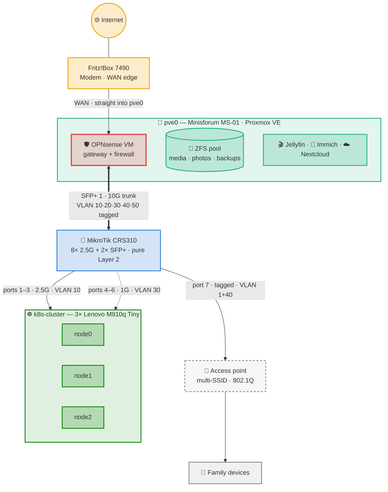

# 🎨 Diagram Design System — Colors & Conventions

[← Back to Setup Overview](../README.md)

Every diagram in this repository — Mermaid in Markdown, exported SVG, or a drawing made in draw.io — uses the same colors for the same kinds of things. A switch is blue in the network diagram, in the cluster diagram and in the power schematic. That consistency is the entire point: once a reader learns the five colors, every later diagram is readable without a legend.

This page defines the palette, says which component gets which color, and gives a copy-paste block for Mermaid.

---

## Why This Matters

A diagram that invents its colors each time forces the reader to re-learn it every time. Worse, hand-picked colors tend to collapse: two hues that look different on the author's screen turn into the same gray for a colorblind reader, or vanish against a dark background when GitHub switches themes.

So the palette here is not a taste decision. It is derived from a validated categorical palette and checked with a script against the things that actually break — colorblind separation, distinguishability under normal vision, and contrast against both a white and a dark page. The section [How This Was Validated](#how-this-was-validated) documents the results and how to re-run them.

---

## The Palette

Five colors, one hex each. **The same hex is used in light and dark mode** — GitHub renders Mermaid with a single set of class definitions and does not swap colors per theme, so every value below has to survive both surfaces.

| Slot | Hue | Hex | Contrast on white | Contrast on dark |
|---|---|---|---:|---:|
| 1 | blue | `#2a78d6` | 4.42 | 4.29 |
| 2 | aqua | `#1baf7a` | 2.82 ⚠️ | 6.72 |
| 3 | red | `#e34948` | 3.95 | 4.79 |
| 4 | yellow | `#eda100` | 2.17 ⚠️ | 8.74 |
| 5 | green | `#008300` | 4.95 | 3.83 |

⚠️ Aqua and yellow sit below the 3:1 mark on a white page. That is acceptable here **only because every node in these diagrams carries a visible text label** — the color never has to identify a box on its own. Do not use these two as a thin line or an unlabeled dot on a light background.

**Five is the cap, and it is a hard one.** A sixth color cannot be added without breaking one of the checks: violet drops to 2.21 contrast on a dark page, and magenta lands 13.2 ΔE from red under normal vision — below the 15 floor, meaning readers with full color vision would struggle to tell them apart. When a diagram needs a sixth distinction, use shape or border style, never a new hue.

---

## Which Component Gets Which Color

Color encodes the **layer a component belongs to**, not the individual device. Two switches are both blue; a switch and a router are never the same color.

| Layer | Color | What belongs here | Examples in this homelab |
|---|---|---|---|
| **Edge / untrusted** | 🟡 yellow `#eda100` | Everything on the internet side of the firewall | Internet, ISP line, Speedport, Fritz!Box as modem, WAN link |
| **Security boundary** | 🔴 red `#e34948` | The devices that decide what may pass | OPNsense, firewall zones, VPN entry, cloudflared tunnel |
| **Network fabric** | 🔵 blue `#2a78d6` | Everything that moves frames without deciding | CRS310, patch panel, SFP+ trunk, VLANs, access point, MetalLB pool |
| **Host / hypervisor** | 🟢 aqua `#1baf7a` | Physical machines and the virtualization layer | pve0 / MS-01, Proxmox VE, VMs, LXC containers, ZFS pool |
| **Cluster / workload** | 🟩 green `#008300` | Kubernetes and what runs on it | node0–2, Talos, pods, Longhorn, Traefik, the family apps |

Two conventions on top of the five:

- **Clients are not infrastructure.** Family phones, laptops, TVs and IoT devices get no color at all — neutral gray fill, gray border. They are what the lab exists for, not part of it, and leaving them uncolored keeps the eye on the infrastructure.
- **Status is separate and reserved.** If a diagram marks something as broken, planned or degraded, that is a *state*, not a layer — use a dashed border or a badge in the label (`⬜ planned`, `⚫ inactive`), matching the status markers already used in the component tables. Never repurpose one of the five layer colors to mean "down".

---

## Containers: Low Opacity, Strong Border

A container — a Proxmox host holding VMs, the cluster holding its nodes, a VLAN holding its members — is drawn as a **wash of its layer color with a full-strength border**. The tint groups the contents; the border draws the boundary. Filling a container solid would make everything inside it fight for attention.

| Element | Fill | Border | Border width |
|---|---|---|---|
| **Container / zone / subgraph** | layer color at **12 %** (`…1f`) | layer color, full strength | 2 px |
| **Node inside a container** | layer color at **20 %** (`…33`) | layer color, full strength | 2 px |
| **Emphasis node** (the firewall, the failure point under discussion) | layer color at **20 %** | layer color, full strength | 3 px |
| **Client / out of scope** | neutral gray at 12 % | gray `#898781` | 2 px |
| **Planned / not yet bought** | layer color at 8 % | layer color, **dashed** | 2 px |

The percentages are written as the last two digits of an 8-digit hex: `#2a78d61f` is blue at 12 %, `#2a78d633` is blue at 20 %. Alpha is what makes one value work in both themes — 12 % blue over a white page is a pale wash, and the same value over a dark page is a subtle dark blue. A pre-mixed pastel hex would only work on one of the two.

> ⚠️ **Never set `color:` in a Mermaid `classDef`.** Leave the text color out and Mermaid takes it from the active GitHub theme — dark ink on the light page, light ink on the dark one. Hard-coding it produces black text on a near-black fill for every reader using dark mode.

---

## Copy-Paste Block for Mermaid

Paste this at the end of any `flowchart`, then tag nodes with `class <id> <name>`:

```text
    %% ---- Homelab diagram palette · setup/schematics/README.md ----
    classDef edge      fill:#eda10033,stroke:#eda100,stroke-width:2px
    classDef security  fill:#e3494833,stroke:#e34948,stroke-width:3px
    classDef fabric    fill:#2a78d633,stroke:#2a78d6,stroke-width:2px
    classDef host      fill:#1baf7a33,stroke:#1baf7a,stroke-width:2px
    classDef cluster   fill:#00830033,stroke:#008300,stroke-width:2px
    classDef client    fill:#8987811f,stroke:#898781,stroke-width:2px
    classDef planned   fill:#89878114,stroke:#898781,stroke-width:2px,stroke-dasharray:5 4

    %% containers (subgraphs) — same hue, lighter wash
    classDef boxHost    fill:#1baf7a1f,stroke:#1baf7a,stroke-width:2px
    classDef boxCluster fill:#0083001f,stroke:#008300,stroke-width:2px
    classDef boxFabric  fill:#2a78d61f,stroke:#2a78d6,stroke-width:2px
```

A subgraph is styled the same way as a node — `class <subgraphId> boxHost`.

### Worked example



Note what the styling carries beyond color: the access point is **dashed** because it is not bought yet, the family devices are **gray** because they are not infrastructure, the firewall has a **3 px** border because it is the boundary the whole design is about, and the ZFS pool uses Mermaid's **cylinder shape** `[( )]` rather than a sixth color.

---

## Line Conventions

Links carry meaning too, and they use weight and pattern rather than color, so they stay legible in both themes:

| Link | Mermaid | Means |
|---|---|---|
| `---` | thin solid | physical cable, no direction implied |
| `-->` | solid arrow | data path, primary |
| `<==>` | thick | trunk or high-bandwidth link (10G, LACP) |
| `-.->` | dashed | secondary path — management, fallback, monitoring |
| `-.->` + `planned` class | dashed | not built yet |

Label every link that crosses a boundary with its port, speed and VLAN — `ports 1–3 · 2.5G · VLAN 10`. A diagram whose lines are unlabeled forces the reader back into the port table.

---

## How This Was Validated

The five hexes are slots from a validated categorical palette, checked as a set with the `dataviz` skill's validator under the **all-pairs** rule — the strict test, because in a topology diagram any two component types can end up side by side.

| Check | Result |
|---|---|
| Lightness band | PASS — all five inside the band |
| Chroma floor | PASS — no hue reads as gray |
| Colorblind separation (protan/deutan) | ⚠️ floor band — worst pair aqua ↔ red, ΔE 6.9. Legal **because every node is labeled**; color is never the only identity cue |
| Normal-vision floor | PASS — worst pair green ↔ aqua, ΔE 15.6 (floor is 15) |
| Contrast vs surface | PASS on dark; aqua and yellow below 3:1 on white — covered by the same visible-label rule |

Two findings worth keeping in mind when extending this:

- **Dark mode is the binding constraint.** Of all four-color combinations from the source palette, 26 pass on a light page and only 2 pass on a dark one. Any new color has to be checked against the dark surface first — that is where candidates die.
- **Aqua ↔ red is the weak pair.** They are the two colors most at risk of merging for a colorblind reader. Keeping the host layer and the security layer visually apart therefore leans on the labels and on the firewall's thicker border; if a future diagram ever puts an unlabeled aqua mark next to an unlabeled red one, that diagram is wrong.

To re-run the checks after any change:

```bash
node scripts/validate_palette.js "#2a78d6,#1baf7a,#e34948,#eda100,#008300" --mode light --pairs all
```

---

## Drawing Tools

| Tool | Use it for | Cost |
|---|---|---|
| **Mermaid** | Diagrams that live inside a README and should stay editable as text. GitHub renders them natively — no image files, no export step. The default for this repository | free |
| **draw.io / diagrams.net** | Detailed diagrams with device icons — rack layouts, cabling, anything Mermaid's automatic layout cannot place. Keep the `.drawio` source in the repo next to the exported SVG so it stays editable | free |
| **Excalidraw** | Quick sketches while thinking. Not for anything that ends up documented | free |

Exported images belong in this folder and are embedded as HTML `` tags, matching the existing schematics. When exporting from draw.io, choose **SVG** — it stays sharp at any zoom and diffs better than a PNG.
